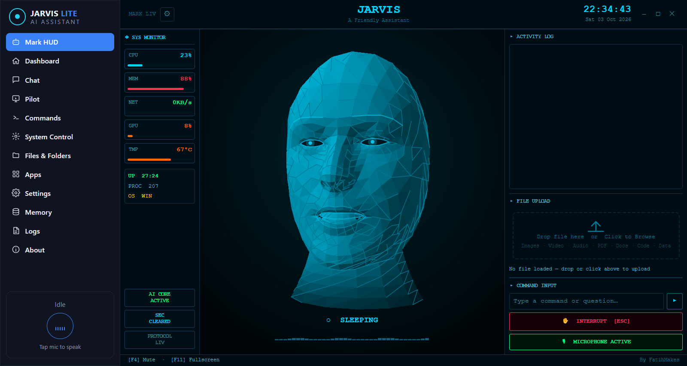

# Jarvis Lite

A voice assistant for your desktop that talks back, has a face, and runs your
computer.

Talk to it the way you would talk to a person. It answers out loud in real
time, in your language, while a holographic head in the middle of the window
mouths the words. Ask it to open an app, find a file, turn the volume down,
look at your screen, search the news or message someone, and it does it.

It comes in two halves that share one window:

- **[Mark HUD](#mark-hud--the-voice-assistant)** — the default view. A full port
  of [Mark LIV](https://github.com/FatihMakes) onto Electron: Gemini Live voice,
  lip-synced face, 24 tools, memory, undo, a phone remote. Needs a free Gemini
  API key.
- **[The local assistant](#the-local-assistant)** — the original jarvis-lite. A
  rule planner, a screen-driving Pilot, an on-device language model and a
  Whisper wake word. No API key, nothing leaves the machine.



## Mark HUD — the voice assistant

### Status

**It runs, and every tool is in.** The whole of Mark LIV is ported — voice,
face, tools, memory, wake word, phone dashboard — and the build is clean.

- 24 tools load: Mark's 8 core tools plus 16 actions (apps, settings, keyboard
  and mouse, desktop, files, documents, code helper, dev agent, web search,
  browser, YouTube, flights, weather, reminders, messaging, game updates).
- The face is MediaPipe's 468-point face model built into a full head — 810
  vertices, 1,554 faces — matching Mark's Python output exactly.
- Lip-sync reads mouth shapes from the audio itself and from the transcript;
  its numbers match Mark's to within 0.000005.
- "Hey Jarvis" scores 0.999 on a spoken test clip and 0.0001 on an ordinary
  sentence.
- The phone dashboard passes 34 of 34 end-to-end checks.
- Typecheck is clean and the original self-test still passes 40 of 40.

It is light enough for a modest laptop. The face draws its surface in one pass
rather than as ~1,800 separate canvas calls, which took its GPU cost from about
23% to about 6%, and the gauges read from one long-lived sensor process instead
of starting PowerShell every second.

The live conversation has had real use but not systematic testing: it connects,
talks and calls tools, and the first real-world bug it surfaced (WhatsApp
looping when the desktop app isn't installed) is fixed. Each tool was tested on
its own; tools driven by voice, one after another, have not been run through a
checklist yet.

### Try it

```bash
npm install
npm run app        # builds once, then opens the fast version
npm start          # opens it again later, without rebuilding
```

On first launch it asks for a Gemini API key — free from
[Google AI Studio](https://aistudio.google.com/app/apikey). Then just talk.

`npm run electron:dev` is for editing the code. It runs a development server
with extra checks and is several times heavier; don't judge its speed by it.

### What it does

- **Real-time voice** in any language over Gemini Live. It answers in whatever
  language you last spoke, and says one short sentence before anything slow so
  you are never left in silence.
- **A face that is a status light.** It looks away while thinking, meets your
  eyes while listening, lets its lids fall while asleep, and mouths real
  consonants — lips close on *m*, *b*, *p*. Switch to the reactor-core HUD in
  ⚙ if you would rather not have a face looking back.
- **Runs your computer.** Apps, volume, brightness, Wi-Fi, dark mode, windows,
  keyboard and mouse, files and folders, documents, the browser, YouTube.
- **Sees on request.** "What's on my screen?" or "look at me" takes one frame
  from the screen or webcam.
- **Remembers you.** Names, preferences, projects, people — stored on your
  machine, shown in ⚙ → Memory, where any of it can be deleted.
- **Takes things back.** Say "undo" and it reverses its own last change: files
  moved, renamed, written or deleted, settings adjusted.
- **Asks before the irreversible.** Shutdown, restart and Wi-Fi off put a
  CONFIRM button on screen. The model cannot press it for you.
- **Wakes on "Hey Jarvis"**, fully offline, and sleeps after two minutes of
  quiet. Or hold **Ctrl+Space** to talk.
- **Messages people.** WhatsApp through the installed app, or WhatsApp Web in
  your browser when the app isn't there.
- **Starts the day.** A morning briefing with the time, what you talked about
  yesterday, and the news. Quiet check-ins after a long silence, alerts when the
  CPU runs hot, and daily news on topics you ask it to follow.
- **Phone remote.** ⚙ → Remote Control shows a QR code; scan it on the same
  Wi-Fi and type or talk to the PC from your phone.
- **Plugins.** Drop a `.js` file with a `PLUGIN` object and a `run()` into the
  plugins folder and it learns a new skill.

### Controlling it from your phone

1. Start Jarvis on the PC. The first time, allow the firewall prompt.
2. ⚙ (top left) → **◉ REMOTE CONTROL**.
3. On a phone on the **same Wi-Fi**, scan the QR code — or type the manual
   address it shows and enter the six-letter key. Accept the certificate
   warning once; the certificate is made on your PC.

Everything runs on the PC; replies are spoken there and shown as text on the
phone. Away from home, put both devices on [Tailscale](https://tailscale.com)
and use the PC's Tailscale address.

### Limits worth knowing

- **The PC does the work.** There is no phone version; the phone is a remote.
- **WhatsApp by keystrokes.** It types into whatever window is in front, as Mark
  did. Keep your hands off for the ~15 seconds it takes, and close any other
  WhatsApp Web tab first or WhatsApp will ask "Use here?".
- **YouTube trending** returns nothing: YouTube's trending page no longer lists
  videos.
- **Interrupting by voice is off**, as in Mark — it depends too much on the
  room. Press **Esc** or INTERRUPT.
- Your voice goes to Google's Gemini Live API while a session is open. That is
  the one thing that leaves the machine.

### Your data

| What | Where |
|---|---|
| Gemini key and settings | `%APPDATA%\jarvis-lite\mark\config.json` — plain text, treat it like a password |
| What it remembers about you | `%APPDATA%\jarvis-lite\mark\long_term.json` — delete it to make it forget |
| Phone dashboard certificate | `%APPDATA%\jarvis-lite\mark\certs\` — delete it if your local IP changes |

None of these are in the repository.

### How it is built

The renderer owns the conversation: the Live session, the microphone, the
speakers and the HUD. The main process owns everything privileged: the key,
memory, undo, the confirmation gate and every tool that touches the machine.
They talk over `mark:*` IPC calls one way and a single `mark:event` channel the
other.

```
lib/mark/live.ts          The Live session: connect, resume, tools, vision, background loops
lib/mark/audio.ts         Mic at 16 kHz, speakers on one scheduled timeline
lib/mark/viseme.ts        Mouth shapes from the audio spectrum and the transcript
lib/mark/echo.ts          Tells your voice from its own echo after it stops talking
lib/mark/wake*.ts         "Hey Jarvis" — openWakeWord on onnxruntime-web, in a worker
lib/mark/avatar/          The head: mesh, rig, lighting, software renderer
app/components/mark/      The HUD and its overlays

electron/mark/index.js    IPC, inline tools, the system prompt
electron/mark/actions/    One file per tool — drop in another to add one
electron/mark/services/   System monitor, topic monitor, proactive check-ins
electron/mark/dashboard.js  The phone remote: HTTPS + WebSocket
electron/mark/gemini.js   One-shot Gemini calls, with timeouts and a model ladder
```

[docs/MARK-LIV-PORT.md](docs/MARK-LIV-PORT.md) has the contracts between the
pieces. To run any tool on its own, headless:

```bash
npx electron scripts/mark-run-tool.js --list
npx electron scripts/mark-run-tool.js recall_memory '{"query":""}'
```

### Credit

Mark LIV is by [FatihMakes](https://www.youtube.com/@FatihMakes) and licensed
[CC BY-NC 4.0](https://creativecommons.org/licenses/by-nc/4.0/) — personal and
non-commercial use. This port inherits that licence. The face is MediaPipe's
canonical face model, Apache 2.0.

## The local assistant

The original jarvis-lite, still one click away in the sidebar.

A hand-written planner turns one spoken or typed sentence into an ordered plan
of steps, then an executor runs them, pausing to ask you only about the parts
it genuinely cannot infer. The rules are instant, free and deterministic, and
they handle most of what anyone actually says.

Everything beyond them is **local, and inside the app**: no API key, no
account, nothing sent anywhere.

- **[Pilot](#pilot--using-the-computer)** — reads the screen and drives it.
- **[The local model](#the-local-model--understanding-anything-else)** — a
  small language model for sentences the rules don't cover.
- **[The wake word](#the-wake-word--always-listening)** — say "Jarvis" and it
  wakes up, transcribed by Whisper running in-process.

Both models are off until you switch them on, because turning them on
downloads them.

```
hey jarvis, open chrome with profile saeed and search whatsapp web
                         and text someone a message

  1. ✓ Open Google Chrome (profile: saeed)
  2. ✓ Open WhatsApp Web
  3. ? Send a WhatsApp message
     → "Who should I send it to?"
```

## What it does

- **Chained commands.** One sentence, many steps. `and`, `then`, `after that`
  and commas separate instructions — but only when a real action follows, so
  "search for cats and dogs" stays a single search.
- **Drives and folders.** "open d drive", "go to the projects folder", "what's
  in downloads", "go up". Where you are carries between steps, so a sequence of
  spoken navigation behaves like a shell — `open d drive` then `go to projects`
  lands in `D:\projects`. A folder name that matches several places asks which
  one rather than picking.
- **Slot extraction.** Pulls browser profiles (`with profile saeed`), phone
  numbers, quoted message bodies (`saying "running late"`), and wait durations
  out of plain language.
- **Chrome / Edge / Firefox profiles.** Says a display name, launches the right
  profile — Jarvis reads Chrome's `Local State` to map "saeed" to its on-disk
  profile directory.
- **WhatsApp messaging.** Opens the chat with your message pre-filled. Contacts
  are learned: the first time you name someone it asks for the number, then
  remembers it.
- **Asks instead of failing.** A half-specified step pauses the plan and asks
  for the missing piece, then resumes where it left off — completed steps are
  never re-run.
- **Confirms destructive actions.** Shutdown, restart, lock and sleep need an
  explicit yes.
- **Stops on failure.** If step 2 fails, steps 3+ are skipped rather than run
  against a state that never happened.
- **Learns unknown commands.** An unrecognised phrase becomes a question, and
  your answer is saved to memory and reused.
- Voice in (Web Speech API) and out (SpeechSynthesis), dark/light themes, and a
  10-page dashboard.

## Pilot — using the computer

Everything above works by matching patterns in what you *say*. Pilot works by
reading what is on the *screen*: it pulls the accessibility tree of whatever
window is in front, finds the control you named, and clicks it. No screenshots
leave the machine, there is no API bill and no rate limit, because there is no
model.

Record a task once and it replays without anything in the loop — deterministic,
and typically tens of milliseconds a step.

```
                        Pilot ▸ Record ▸ "enter one invoice"
                        …do the task once…

  1. Focus the "Sage 50 Accounts" window
  2. Click the "New Invoice" button
  3. Type "INV-4471"
  4. Click the "Save" button          ← needs a yes: it sends something
```

Say `pilot run enter one invoice` in chat, or press Run in the Pilot panel.

### What it actually does

- **Grounds through the accessibility tree, not pixels.** A recorded step
  stores a *description* of its target — accessible name, control type,
  automation id, roughly where it sat — and resolves it again on every replay.
  A workflow therefore survives a moved window, a different resolution and a
  rearranged toolbar. Replaying coordinates would not.
- **Refuses rather than guesses.** Every match carries a confidence, and the
  margin over the runner-up is folded into it: two equally good "Delete"
  buttons is an *ambiguous* answer, not a 90% confident one. Below the floor,
  the step stops and says why. An agent that clicks when unsure is worse than
  one that stops.
- **Notices when nothing happened.** A click that leaves the screen unchanged
  is re-grounded and retried once; a second silence is reported instead of
  papered over, so "the dialog never opened" stops the run rather than letting
  the next eight steps type into the wrong window.
- **A dry run that really checks.** The plan preview is not a rendering of the
  saved steps — it re-grounds every target against the screen as it is right
  now and tells you which ones it can find, with the confidence and the
  milliseconds it took.
- **Safety that is code, not a prompt.** Every action passes a guard in the
  main process, judged against the window that is genuinely in front (read
  there, not trusted from the renderer). Irreversible things are *blocked* with
  no override: permanent deletes, formatting, anything in a window that looks
  like a bank or a credential prompt, `rm -rf`-shaped text, shift-delete.
  Consequential-but-reversible things — paying, sending, typing into a shell —
  need an explicit yes for that one step.
- **An undo journal.** Any file a workflow touches is backed up first; a delete
  moves the file into the journal rather than removing it. "Undo this run"
  unwinds the whole run, newest operation first.
- **A stop that can always be reached.** Pilot owns the mouse while it runs, so
  the on-screen button may be unclickable. **Ctrl+Alt+X** stops it from
  anywhere, and the flag lives in the main process where a wedged window cannot
  fail to honour it.

### What it can't do yet

Pilot grounds through the accessibility tree, which is exact and fast when an
app exposes one — and silent when it doesn't. An app that draws its own
interface (a canvas, a remote desktop, a game, an Electron app that never set
an accessible name) reports nothing addressable, and Pilot says so and stops.

Answering that case is the open problem: a small vision model, running locally
on your own GPU, that can say *where* the Save button is in under a second a
step. `lib/pilot/vision.ts` is the seam it plugs into — it currently reports
itself unavailable, and the runner fails honestly rather than guessing at a
coordinate. That is the state of the project, not a bug.

Pilot's screen control is **Windows-only**; the rest of Jarvis is not.

### Two deliberate limits

- **Recording does not watch the keyboard.** Clicks are enough to replay a
  workflow, and a recorder that captured every keystroke on the machine would
  be a keylogger with a friendly name. Typed steps are added by hand in the
  panel, where they are visible and editable.
- **Blocked is blocked.** There is no flag that lets Pilot do the things in the
  block list. You can still do them yourself.

## The local model — understanding anything else

The rules are patterns, and patterns are finite. Phrase something a way nobody
wrote a regex for and Jarvis can only offer to be taught it.

Turning this on puts a small language model **inside the app** — not Ollama,
not a server, not an API. It runs on WebGPU where the machine has it and falls
back to WASM where it doesn't. The weights (~400MB) download once from the
Hugging Face CDN and are cached; the ONNX runtime ships with the app. After the
first run it works with the network unplugged.

```
you: "jarvis pull up that projects thing on my d drive"

  rules  → no match
  model  → [{"intent":"open_path","path":"D:\\projects"}]
  ✓ Opened D:\projects
```

Rules run first, always. The model is only asked about what they could not
resolve, so the common path stays instant and free.

**The model proposes; it does not decide.** Everything it returns goes through
[schema.ts](lib/brain/schema.ts), which validates against a closed list of
intents. Three rules hold there:

- An intent it invents is **dropped**, not guessed at — there is no "close
  enough" mapping.
- `dangerous` is set by *our* code from the intent's kind, never by the model.
  It cannot mark a shutdown as safe, because it is not asked; destructive steps
  keep going through the same confirmation the rules use.
- A URL that isn't `http(s)` never reaches the shell.

Model: Qwen2.5-0.5B-Instruct, 4-bit. Chosen for size over cleverness — the job
is filling a fixed JSON schema, not reasoning, and a multi-gigabyte model is
the wrong trade for an assistant that has to feel instant.

## The wake word — always listening

The Web Speech API that Jarvis used before **does not work in Electron and
cannot be made to**: Chromium's implementation posts audio to Google's speech
service using an API key compiled into official Chrome builds, which Electron
does not ship. It fails with a `network` error every time — the old "Voice
recognition error." message.

So transcription happens locally instead, on a Whisper model in-process.

```
[tray, mic live]
  you: "jarvis"              → the window opens, listening
  you: "open d drive"        → ✓ Opened D:\

  or in one breath:
  you: "jarvis open d drive" → ✓ Opened D:\
```

- **The model never listens continuously.** An energy gate with an adaptive
  noise floor decides what is speech; Whisper only ever sees a complete
  utterance. Running it on every frame would burn the GPU on silence, which is
  almost all of any minute.
- **Jarvis stays in the tray** when you close the window. Nothing can hear you
  if no process is running — that is the cost of a wake word, not a bug.
  Quit properly from the tray menu. **Ctrl+Alt+J** summons the window for when
  the wake word mishears or the mic is off.
- The wake word matcher is **deliberately generous** — Whisper mishears
  "Jarvis" constantly. A stray wake now and then is much cheaper than missing
  every third real one.

No audio leaves the machine, at any point.

## Architecture

The agent loop is split so that planning is pure and testable — the planner
never touches the OS, and the executor owns every side effect. Pilot keeps the
same split: grounding is a pure function of an accessibility tree, so every
mis-click can be reproduced from a captured tree with no screen attached.

```
lib/nlu.ts        Wake word, compound splitting, slot extraction   (pure)
lib/planner.ts    Utterance -> Plan { Task[] }                     (pure)
lib/executor.ts   Runs tasks in order, pauses for input            (effects via IPC)
lib/store.ts      Zustand state; owns the pause/resume conversation

lib/pilot/grounder.ts  Target + elements -> a scored click point   (pure)
lib/pilot/vision.ts    The local-vision seam; currently empty      (pure)
lib/pilot/recorder.ts  Clicks -> a replayable workflow
lib/pilot/runner.ts    Ground -> guard -> act -> verify -> recover
lib/pilot/store.ts     Pilot panel state; live run progress

lib/brain/schema.ts    What the model may say, and the validator that enforces it
lib/brain/prompt.ts    The intent list and worked examples
lib/brain/worker.ts    Qwen on WebGPU/WASM, in a worker
lib/voice/listener.ts  Mic, energy gate, wake word
lib/voice/worker.ts    Whisper on WebGPU/WASM, in a worker

electron/main.js       Privileged actions: launching, URLs, system, WhatsApp
electron/preload.js    contextBridge surface exposed as window.jarvis
electron/pilot/host.ps1  Long-lived PowerShell: UI Automation + SendInput
electron/pilot/bridge.js JSON-lines protocol to that host
electron/pilot/guard.js  The block/confirm gate every action passes
electron/pilot/journal.js  Undo journal with real backups
electron/pilot/capture.js  Cheap screen hashing for change detection
```

The PowerShell host is started **once** and reused. Spawning `powershell.exe`
per action costs 250–400 ms before any work happens, which alone blows the
per-step budget; a warm host answers in single-digit to low tens of
milliseconds. Inside it, the accessibility tree is read through a single
`CacheRequest` — one cross-process round trip for every property of every node
instead of one per property, which is the difference between a snappy read and
a multi-second one on a browser window.

Because the planner is pure, you can exercise it in plain Node without Electron:

```js
const { planUtterance } = require('./lib/planner');
planUtterance('open chrome with profile saeed then lock pc', memory).tasks;
```

## Getting started

Requires Node.js 18+.

```bash
npm install

# Browser only - system actions are simulated, nothing touches your OS
npm run dev

# Real desktop app (Next dev server + Electron). Pilot and the wake word
# only work here.
npm run electron:dev

# Typecheck, and test the pure logic (planner, grounder, validator, guard)
npm run typecheck
npm run selftest
```

`npm run assets` runs automatically before dev and build. It copies the ONNX
wasm runtime out of `node_modules` into `public/ort` and bundles the two model
workers into `public/workers`. Both directories are generated and gitignored.

The workers are built by esbuild rather than by Next, because Next emits
workers as *classic* scripts and a classic script cannot contain
`import.meta` — which transformers.js and several of its dependencies use. The
build dies on a parse error deep inside a vendor bundle. Building them as real
ES modules sidesteps it, and keeps several megabytes of inference code out of
the app's own bundle, where it has no business being.

## Building an installer

```bash
npm run dist
```

`next build` statically exports to `out/` (via `output: 'export'`), then
electron-builder packages it into `dist/` — `.exe` on Windows, `.dmg` on macOS,
`.AppImage` on Linux.

To ship custom icons, drop `icon.ico` / `icon.icns` / `icon.png` into a `build/`
directory; electron-builder picks them up automatically.

## Security notes

- Every OS call uses `spawn`/`execFile` with an **argument array** and
  `shell: false`. User text can never inject a second command — asking to open
  `a & calc` looks for an app literally named `a & calc` and fails.
- `openUrl` only accepts `http(s)`, so a crafted `file://` or custom scheme
  can't be handed to the shell.
- The renderer runs with `contextIsolation: true` and `nodeIntegration: false`;
  all privilege lives behind the narrow `window.jarvis` bridge.
- In-app navigation and popups are denied — external links open in your real
  browser.

## Limits worth knowing

- **WhatsApp auto-send is off by default.** WhatsApp has no supported API for
  sending from a link; the click-to-chat URL can only *pre-fill* a message. The
  optional auto-send (Settings) waits a few seconds and sends a synthetic Enter
  to the foreground window — if you click elsewhere during that pause, the
  keystroke goes to the wrong window. It's Windows-only.
- **Contacts are addressed by number.** WhatsApp links can't target a display
  name, which is why Jarvis asks for a number the first time it meets a name.
- **Profile names need Chrome's `Local State`** to be readable. If it isn't,
  Jarvis passes your text through as the literal directory name and tells you
  when it couldn't apply the profile rather than silently ignoring it.
- **The rules are not a language model.** They understand the patterns in
  `lib/nlu.ts` and the vocabulary in `lib/commands.ts`. Phrasing far outside
  those becomes a "teach me" prompt — or goes to the local model, if you turned
  it on.
- **Both models download on first use.** ~400MB for the language model, ~40MB
  for speech. They are cached afterwards and never re-fetched, but the first
  run needs a connection and a minute.
- **A 0.5B model is small.** It is reliable at filling the JSON schema it is
  given and unreliable at anything else, which is why it is only ever asked to
  do the former. Expect it to miss occasionally; it fails to a "teach me"
  prompt rather than to a wrong action.

## Extending it

- New apps/sites → add an entry to `KNOWN_APPS` / `KNOWN_SITES` in
  `lib/commands.ts`. Aliases are matched longest-first, so `whatsapp web`
  correctly beats `whatsapp`.
- New action types → add a `TaskKind` in `lib/types.ts`, plan it in
  `lib/planner.ts`, execute it in `lib/executor.ts`.
- New phrasings → extend the patterns in `lib/nlu.ts`.
- New Pilot step kinds → add to `PilotStepKind` in `lib/pilot/types.ts`, run it
  in `runStep` (`lib/pilot/runner.ts`), and give it a rule in
  `electron/pilot/guard.js` if it can do something you'd want stopped.
- A local vision grounder → implement `VisionGrounder` and call
  `registerVisionGrounder` once at startup. Nothing else changes: the runner
  already asks vision whenever the accessibility tree comes up empty.
# Jarvis
